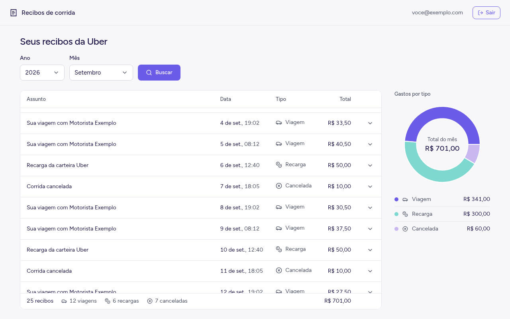
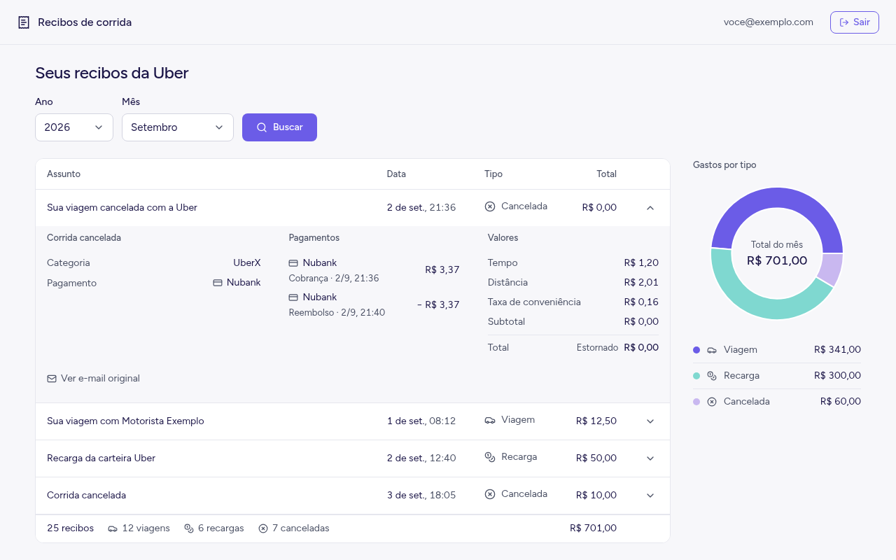
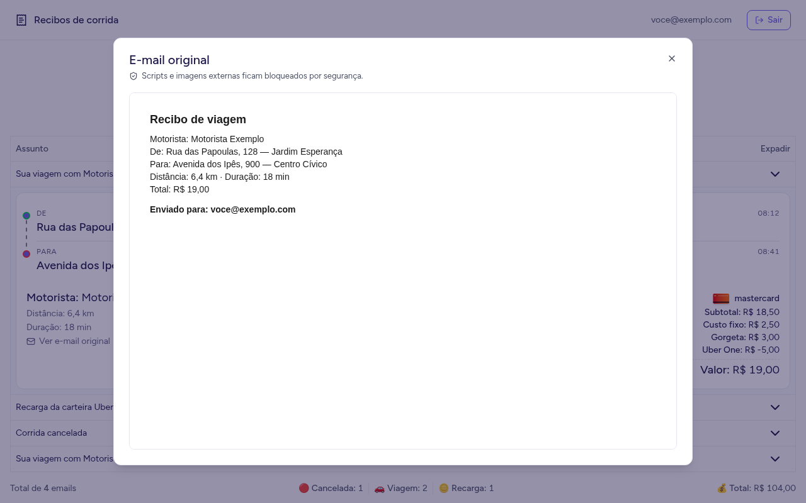
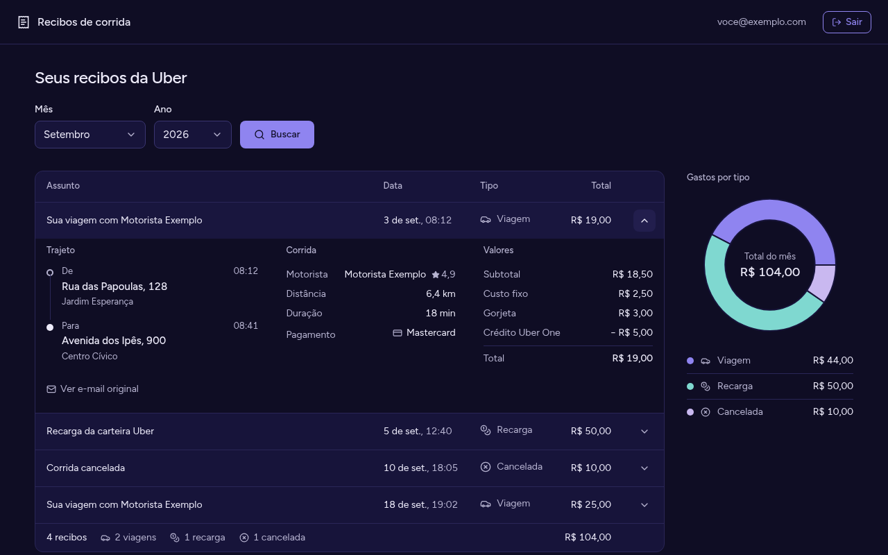
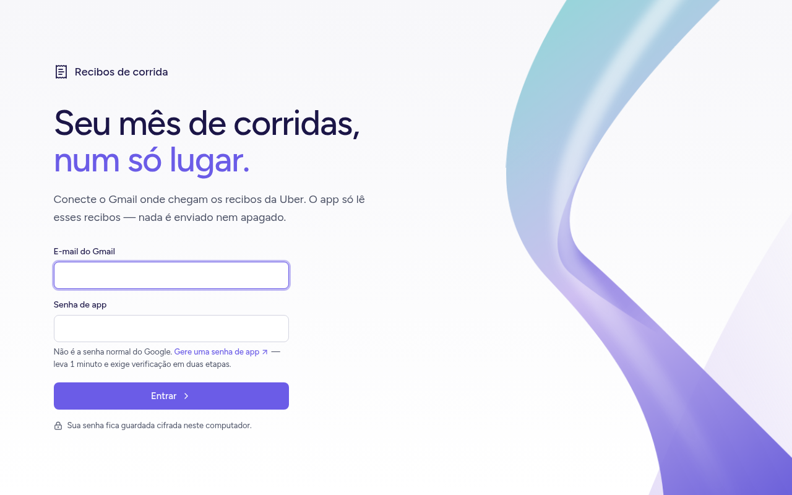

# Recibos de corrida

Um app de computador que lê os **recibos da Uber que chegam no seu Gmail** e mostra, mês a mês, quanto você gastou com corridas. Você não precisa abrir e-mail por e-mail.



> As imagens deste README usam dados fictícios.

## O que ele faz

- **Mostra o total do mês** e separa o gasto por tipo: viagem, recarga de Uber Cash e viagem cancelada.
- **Lista cada recibo** com data, tipo e valor. Clicando numa linha, você vê os detalhes:
  - **Viagem:** motorista, trajeto, distância, duração e forma de pagamento.
  - **Viagem cancelada:** taxa cobrada, reembolso e o aviso "Estornado" quando o valor voltou inteiro.
- **Só oferece meses que têm recibos.** Você escolhe o ano, depois o mês, e clica em **Buscar**. Ao abrir, o app já mostra o mês mais recente.
- **Mostra o e-mail original** dentro do app, sem abrir o navegador.

| Detalhe de uma viagem cancelada | E-mail original |
|---|---|
|  |  |

Também funciona no tema escuro, acompanhando o do sistema:



## Segurança e privacidade

- **O app só lê.** A caixa de entrada é aberta em modo somente leitura: nenhum e-mail é enviado, apagado ou marcado como lido.
- **Ele só olha os recibos da Uber**, que chegam de `noreply@uber.com`.
- **A senha fica cifrada no seu computador**, guardada pelo cofre do sistema (Keychain no macOS, DPAPI no Windows, libsecret no Linux). Ela nunca vai para dentro do programa nem para um arquivo de texto.
- **A conexão com o Gmail é sempre segura** (TLS verificado).
- **O e-mail original abre isolado:** scripts e imagens externas ficam bloqueados, o que também barra os rastreadores de abertura.

## Como usar

### 1. Crie uma senha de app no Google

O app não usa a senha normal da sua conta Google, e sim uma **senha de app**:

1. Ative a [verificação em duas etapas](https://myaccount.google.com/signinoptions/two-step-verification), se ainda não estiver ativa.
2. Abra [myaccount.google.com/apppasswords](https://myaccount.google.com/apppasswords).
3. Dê um nome qualquer, por exemplo "Recibos", e copie a senha de 16 letras que aparecer.

### 2. Entre no app



Informe o seu e-mail do Gmail e a senha de app. Pode colar a senha com os espaços, o app remove sozinho. Na próxima vez, ele já abre logado. Para trocar de conta, clique em **Sair**.

## Para desenvolvedores

Requisitos: **Node.js 20+** e **Yarn 4** (ative com `corepack enable`).

```bash
yarn            # instala as dependências
yarn dev        # abre o app em modo de desenvolvimento
yarn test       # roda os testes (Vitest)
yarn typecheck  # checa os tipos
```

Para gerar o instalador:

```bash
yarn build:mac    # macOS
yarn build:win    # Windows
yarn build:linux  # Linux
```

### Como o projeto está organizado

```
src/
  main/        processo principal do Electron: login, Gmail (IMAP) e leitura dos recibos
  preload/     ponte segura: expõe só window.api para a interface
  renderer/    interface em React + Tailwind
  shared/      contrato entre a interface e o processo principal
```

A identidade visual está descrita em [`DESIGN.md`](DESIGN.md), e o propósito do produto em [`PRODUCT.md`](PRODUCT.md).

> Se o `yarn dev` reclamar que o Electron não foi instalado, rode `node node_modules/electron/install.js`.
